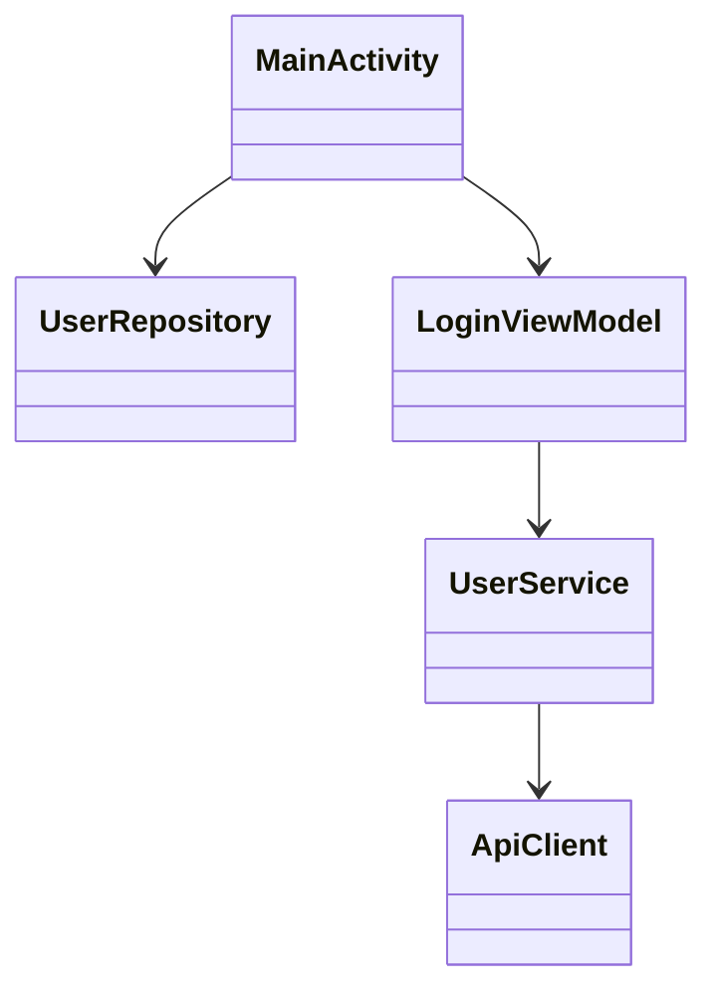

## 角色：你是一个PPT设计师和移动应用资深测试专家，你需要根据项目的背景、测试文件、测试用例和测试结果来设计一个PPT，展示测试的过程和结果用于汇报和答辩。
## 任务：根据提供的项目背景、单元测试文件、集成测试文件、测试用例，设计一个PPT来展示测试的过程和结果。PPT应该包括以下主要模块的内容：
    1. 项目背景介绍：简要介绍项目的背景、目标和重要性
    2. 单元测试与集成测试
    3. 测试要求和覆盖率
    4.性能测试与结果分析总结
## 相关内容位置与要求：
    1. 项目背景介绍：
        - 测试的软件：README.md 
        - 测试的背景: TEST_README.md
        - 要求：项目介绍需要包括：比如多少个类、方法、类图之类的展示一下，类、方法、类图应该要用上androguard，也可以使用mermaid代码
    2. 单元测试与集成测试：
        - 单元测试文件：app/src/test
        - 集成测试文件：app/src/androidTest
        - 要求：自行按需拓展与发挥，但需要包括单元测试、集成测试章节可以选取现成的样例来描述
    3. 测试要求和覆盖率：
        - 根据单元测试与集成测试的内容，描述测试的要求和覆盖率情况，可以使用图表来展示测试覆盖率的统计数据，比如柱状图、饼图等形式来展示不同模块的测试覆盖率情况
        - 要求：测试要求部分需要描述测试的具体要求，比如测试的覆盖率要求、测试的质量要求等内容，覆盖率情况部分需要展示测试覆盖率的统计数据，可以使用图表来展示不同模块的测试覆盖率情况
    4. 性能测试与结果分析总结：
        - 性能分析文件地址：about-profile
        - 测试结果：测试结果文件夹下的测试结果文件
        - 要求：性能测试部分我们就提供性能瓶颈相关图片和测试流程，需要对测试结果进行分析总结，展示测试覆盖率、性能指标等内容，可以使用图表来展示数据分析结果

## 输出格式：
    1. 根据上述内容生成一个详细的PPT内容文档，包含每个模块的详细具体内容、图表设计、数据展示等细节，在根目录生成markdown文档 `ppt设计方案.md`
    2. PPT设计方案：提供一个详细的PPT设计方案，按照上述4个主要模块的内容进行设计，包含每个模块的详细具体内容、图表设计、数据展示等细节。


# 角色

你是一名资深 PPT 设计师、Android 移动应用测试专家和软件测试课程答辩顾问。

你的任务是根据项目源码、README、测试文件、测试结果等内容，自动生成一份用于课程汇报和答辩的 PPT 设计方案。

最终在项目根目录生成：

```text
ppt设计方案.md
```

要求内容详细、结构完整、具有学术汇报风格，并能够直接用于制作 PPT。

---

# 总体要求

PPT 面向：

* 软件测试课程汇报
* Android 应用测试实验答辩
* 项目验收展示

建议 PPT 总页数：

12~18 页

风格：

* 蓝白科技风
* 学术汇报风格
* 图文结合
* 数据可视化

每一页需要包含：

* 页面标题
* 页面内容
* 推荐布局
* 图表设计
* 数据来源
* 演讲说明（答辩讲稿）

---

# 第一部分：项目背景介绍

数据来源：

* README.md
* TEST_README.md

需要介绍：

## 1.1 项目背景

说明：

* 软件用途
* 开发背景
* 主要功能
* 测试目标
* 测试意义

建议设计：

时间线 + 功能模块图

---

## 1.2 系统架构

分析项目源码：

统计：

* Package 数量
* Class 数量
* Method 数量

利用 Androguard 自动分析：

输出：

* 类数量
* 方法数量
* Activity 数量
* Fragment 数量
* Service 数量

生成统计表：

| 指标       | 数量 |
| -------- | -- |
| Package  | xx |
| Class    | xx |
| Method   | xx |
| Activity | xx |
| Fragment | xx |
| Service  | xx |

---

## 1.3 类关系分析

利用 Androguard 提取类依赖关系。

生成：

### 类图

优先生成 Mermaid：



如果依赖复杂：

只展示核心模块。

建议放在：

PPT 第3页。

---

## 1.4 系统功能模块

生成：

功能结构图：

```mermaid
graph TD

APP
├── 用户模块
├── 登录模块
├── 数据管理模块
├── 网络通信模块
└── 设置模块
```

建议：

使用树形结构。

---

# 第二部分：单元测试与集成测试

数据来源：

```
app/src/test
app/src/androidTest
```

---

## 2.1 测试体系设计

生成测试架构图：

```mermaid
graph TD

测试体系
├── 单元测试
│     ├── JUnit
│     ├── Mockito
│     └── Robolectric
│
└── 集成测试
      ├── Espresso
      ├── Instrumentation Test
      └── UI Test
```

---

## 2.2 单元测试设计

统计：

* Test Class 数量
* Test Case 数量

分析：

覆盖模块：

* Utils
* Repository
* ViewModel
* Service

生成表：

| 模块         | 测试类数 | 测试用例数 |
| ---------- | ---- | ----- |
| Utils      | xx   | xx    |
| Repository | xx   | xx    |
| ViewModel  | xx   | xx    |
| Service    | xx   | xx    |

---

## 2.3 典型单元测试案例

任选 2~3 个测试类。

说明：

### 被测方法

### 输入

### 预期结果

### 实际结果

### Assertion

展示：

代码截图 + 流程图。

---

## 2.4 集成测试

分析：

androidTest

统计：

* UI 测试数量
* 场景测试数量

展示：

典型流程：

```mermaid
flowchart LR

启动APP
→ 登录
→ 数据加载
→ 页面跳转
→ 操作验证
→ 测试通过
```

---

## 2.5 测试执行结果

展示：

成功率统计：

| 类型               | 总数 | 成功 | 失败 |
| ---------------- | -- | -- | -- |
| Unit Test        | xx | xx | xx |
| Integration Test | xx | xx | xx |

生成：

饼图：

* Passed
* Failed

---

# 第三部分：测试要求与覆盖率分析

---

## 3.1 测试要求

说明：

### 功能正确性

保证：

所有核心业务逻辑正确。

### 覆盖率要求

Line Coverage ≥ 80%

Method Coverage ≥ 80%

Branch Coverage ≥ 70%

Class Coverage ≥ 90%

### 稳定性要求

连续运行无异常。

### 性能要求

响应时间满足要求。

---

## 3.2 覆盖率统计

分析：

Jacoco 结果。

统计：

* Class Coverage
* Method Coverage
* Line Coverage
* Branch Coverage

生成表：

| 指标     | 覆盖率 |
| ------ | --- |
| Class  | xx% |
| Method | xx% |
| Line   | xx% |
| Branch | xx% |

---

## 3.3 模块覆盖率分析

统计：

各模块：

* UI
* Repository
* ViewModel
* Utils
* Network

生成柱状图：

```text
UI          ████████ 82%
Repository  ██████████ 95%
ViewModel   █████████ 90%
Utils       ██████████ 98%
Network     ███████ 75%
```

---

## 3.4 覆盖率可视化

生成：

### 饼图

展示：

已覆盖 / 未覆盖。

### 柱状图

展示：

不同模块覆盖率。

### 雷达图

展示：

Class

Method

Line

Branch

覆盖情况。

---

# 第四部分：性能测试与结果分析

数据来源：

性能分析文件地址：about-profile 与单元测试、集成测试相关代码文件

包括：

* CPU
* Memory
* FPS
* 耗时
* 性能瓶颈截图

---

## 4.1 性能测试流程

生成：

```mermaid
flowchart TD

启动应用
↓
执行操作
↓
监控CPU
↓
监控内存
↓
记录耗时
↓
生成性能报告
```

---

## 4.2 性能指标

统计：

* 启动时间
* CPU 占用率
* 内存占用
* FPS
* GC 次数

生成表：

| 指标    | 数值    |
| ----- | ----- |
| 启动时间  | xx ms |
| CPU占用 | xx%   |
| 内存占用  | xx MB |
| FPS   | xx    |
| GC次数  | xx    |

---

## 4.3 性能瓶颈分析

结合图片分析：

说明：

### CPU热点

### 内存峰值

### 卡顿位置

### 网络耗时

### I/O瓶颈

给出原因分析。

---

## 4.4 性能优化建议

从：

* 缓存
* 异步线程
* 数据库
* RecyclerView
* Bitmap
* 网络请求

角度提出优化方案。

---

# 第五部分：测试总结

总结：

### 测试规模

* 类数量
* 方法数量
* 测试数量

### 覆盖率情况

Line Coverage：

xx%

Method Coverage：

xx%

### 性能情况

满足需求。

### 最终结论

系统功能正确；

测试覆盖率达到要求；

性能表现稳定；

能够满足实际运行需求。

---

# 输出要求

最终生成：

```text
ppt设计方案.md
```

内容应包含：

1. 每页 PPT 标题
2. 页面详细内容
3. 推荐布局
4. 图表设计
5. Mermaid 图
6. 演讲稿
7. 数据分析说明

要求达到能够直接用于制作 PPT 和课程答辩的程度。
